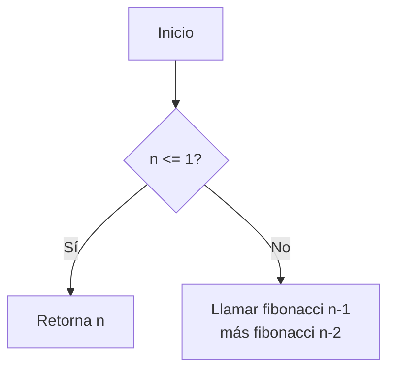
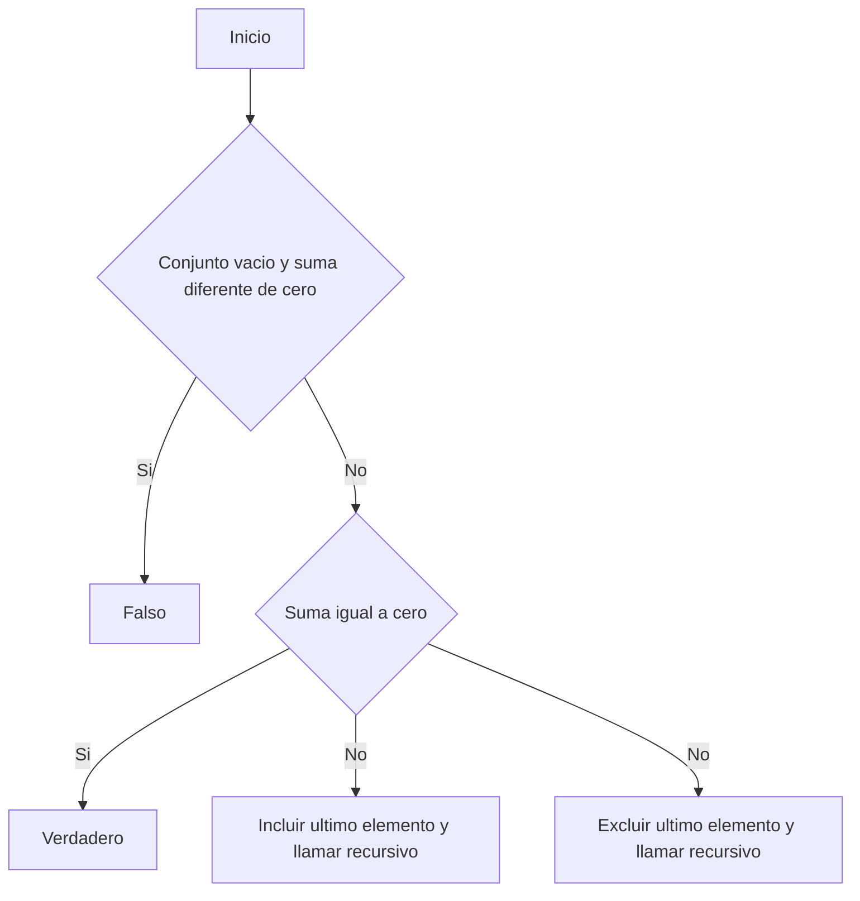
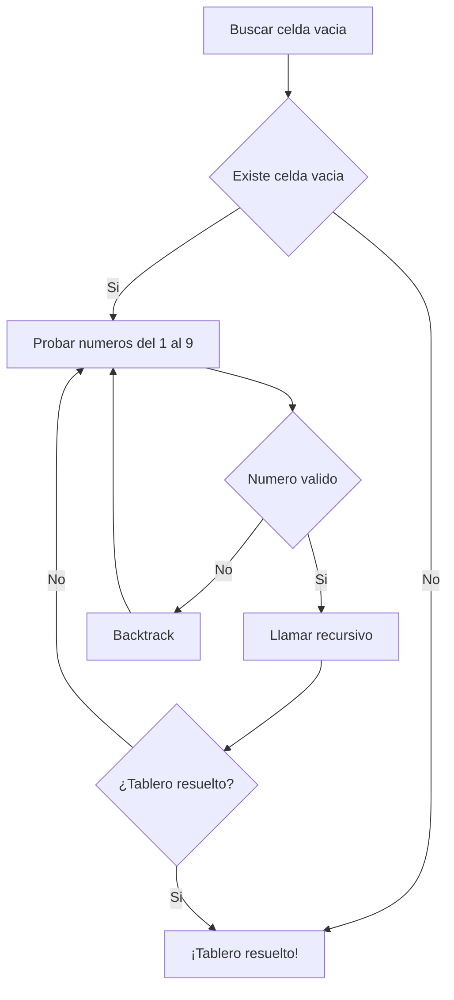

# 📘 Actividad 3 – Estructura de Datos

Implementaciones en Java para:  

- Serie de Fibonacci (recursiva y con memoización)  
- Subset Sum (decisión y reconstrucción de una solución)  
- Resolución de Sudoku por backtracking  

---

## 📂 Estructura  

```
Act_3_ED/
    src/act3ed/
        Fibonacci.java
        SubsetSum.java
        SudokuSolver.java
        MainTests.java   <- ejecuta pruebas simples
```
---

## 🎯 Objetivo

El objetivo de este proyecto es implementar y comprender el uso de recursividad y backtracking en problemas clásicos de programación:

- Cálculo recursivo y optimizado de la serie de Fibonacci.

- Resolución del problema de Subset Sum, incluyendo decisión y reconstrucción de una solución.

- Algoritmo de backtracking para resolver Sudoku.

---

## ⚙️ Requisitos

- Java JDK 8 o superior

- Windows PowerShell o terminal equivalente

- Git para clonar el repositorio

---

## 🛠️ Tecnologías utilizadas
- Lenguaje: Java

- Paradigma: Programación orientada a objetos + Recursividad

- Algoritmos: Backtracking, Recursividad, Memoización

---

## ▶️ Ejecución

1. Compilar:
```
mkdir out; javac -d out .\src\act3ed\*.java
```
2. Ejecutar pruebas (único archivo MainTests.java):
```
java -cp .\out act3ed.MainTests
```
---

## 💻 Uso
El archivo MainTests.java ejecuta automáticamente las pruebas de:

- Serie de Fibonacci

- Subset Sum

- Sudoku Solver

El usuario no necesita interacción manual.

---

## 🔑 API esencial
- int fibonacci(int n) → Retorna el n-ésimo valor de Fibonacci (versión recursiva).

- int fibonacciMemo(int n) → Retorna el n-ésimo valor de Fibonacci con memoización.

- boolean isSubsetSum(int[] set, int n, int sum) → Retorna true si existe un subconjunto que sume el valor objetivo.

- List<Integer> subsetSumSolution(int[] set, int sum) → Reconstruye y devuelve un subconjunto solución si existe.

- boolean solveSudoku(int[][] board) → Resuelve el Sudoku usando backtracking.

---

## 📊 Complejidad
- Fibonacci recursivo: O(2^n) tiempo, O(n) espacio.

- Fibonacci con memoización: O(n) tiempo, O(n) espacio.

- Subset Sum: O(2^n) tiempo en el peor caso.

- Sudoku Solver (Backtracking): O(9^n) tiempo en el peor caso, donde n es el número de celdas vacías.

---

## 🔁 Diagrama de flujo

Fibonacci


Subset Sum


---

## 🧪 Pruebas
El archivo MainTests.java ejecuta automáticamente pruebas para:

- Fibonacci: Valores pequeños y medianos (n=0, 1, 5, 10).

- Subset Sum: Casos con conjuntos positivos, negativos y suma alcanzable o no alcanzable.

- Sudoku: Tableros válidos con distintas cantidades de celdas vacías.

---

## ⚠️ Limitaciones conocidas
- El algoritmo de Fibonacci recursivo simple no es eficiente sin memoización.

- El problema de Subset Sum se vuelve muy costoso en conjuntos grandes.

- El Sudoku Solver puede tardar en resolver tableros extremadamente complejos.

---

## ✅ Conclusión
Este proyecto permitió aplicar conceptos de recursividad y backtracking en problemas clásicos. Se comprendió la importancia de los casos base, la exploración de estados y el análisis de complejidad. Además, se demostró cómo optimizaciones como la memoización mejoran drásticamente el rendimiento de algoritmos recursivos.

---

## 👥 Autores
* Erick Mauricio Santiago Díaz (@Erick-MSD)
* Josué David Murillo Gómez (@Josuemgd15)
* Santiago Sebastian Rojo Márquez (@Sanlaan)
* Daniel Isai Sanchez Guadarrama (@DanielIsaiSG)
